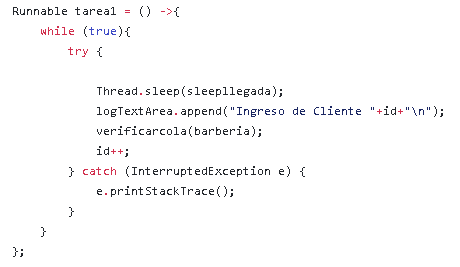

# MANUAL TECNICO PRACTICA 2
---

## Laboratorio Sistemas Operativos 2
### Vacaciones de Diciembre 2020
---

| Carnet | Nombre |
| ------ | ------ |
|200511819     |     Pablo Gerardo Garcia Perusina |
|201602517     |     Marvin Saul Guzman Garcia|
|201602811     |     Oscar Ariel Corleto Soto|

> Guatemala, 12/12/2020

---
---
> ## INDICE

- Introduccion

- Descripcion de la Aplicacion 

- PROBLEMA 1
    - Descripcion
    - Partes del programa en donde existieron múltiples procesos trabajando de forma concurrente y/o paralela, codigo y descripcion.
    - Cómo se realizó la comunicación y sincronización entre procesos.
    - Situaciones en las cuáles era posible que se dieran: deadlocks, condiciones de carrera, etc y cómo se solucionaron.
    - Variables o datos que era necesario compartir entre procesos.
    - Diagrama con imágenes del desarrollo del problema

- PROBLEMA 2
    - Descripcion
    - Partes del programa en donde existieron múltiples procesos trabajando de forma concurrente y/o paralela, codigo y descripcion.
    - Cómo se realizó la comunicación y sincronización entre procesos.
    - Situaciones en las cuáles era posible que se dieran: deadlocks, condiciones de carrera, etc y cómo se solucionaron.
    - Variables o datos que era necesario compartir entre procesos.
    - Diagrama con imágenes del desarrollo del problema

- PROBLEMA 3
    - Descripcion
    - Partes del programa en donde existieron múltiples procesos trabajando de forma concurrente y/o paralela, codigo y descripcion.
    - Cómo se realizó la comunicación y sincronización entre procesos.
    - Situaciones en las cuáles era posible que se dieran: deadlocks, condiciones de carrera, etc y cómo se solucionaron.
    - Variables o datos que era necesario compartir entre procesos.
    - Diagrama con imágenes del desarrollo del problema

---
---
> ## Introduccion

 El siguiente Manual Técnico se realizó para que el lector con conocimientos básicos de sistemas operativos y módulos de kernel, se le proporcione la lógica con la que se ha desarrollado la aplicación, También a detallar mínimas especificaciones de las funciones de cada uno de los elementos de la aplicación

---
---

> ## Descripcion de la Aplicacion

Se realizó una aplicación en la que se debio desarrollar las siguientes aplicaciones y resolver los siguientes problemas utilizando el lenguaje de
programación Java y sobre todo, aplicando de forma correcta los conocimientos vistos en el laboratorio sobre programación concurrente y desarrollo de software con múltiples
hilos. Se analizo cada uno de los problemas y desarrollar los algoritmos necesarios
para su solución.

---
---

># Problema 1 : Filosofos Pensantes

- ## Descripcion
    > Había una vez 5 filósofos que vivían juntos, la vida de cada filósofo consiste básicamente en
pensar y comer, la única comida que contribuida a sus esfuerzos pensantes era el espagueti,
por lo que todas las noches se sentaban los 5 a cenar. En la cena, sentados los 5 filósofos en
una mesa redonda que tiene una fuente de espagueti, van a existir 5 platos uno para cada
filósofo, van a existir 5 tenedores, uno al lado de cada plato (izquierda y derecha). Entonces
cada que un filósofo quiera ir a comer irá al lugar asignado en la mesa, y usando los dos
tenedores que se encuentran al lado de cada plato, los usará para comer el espagueti. Dos
filósofos no pueden utilizar el mismo tenedor a la vez

- ## Partes del programa en donde existieron múltiples procesos trabajando de forma concurrente y/o paralela, codigo y descripcion.

    - > Proceso Concurrente: cuando 2 filosofos tienen hambre al mismo tiempo y tratan de agarrar un tenedor se realiza simultaneamente.

    

    - > Proceso Concurrente: cuando un filosofo no encuentra 1 tenedor pero ya tiene 1 en su poder este tiene que soltarlo ya que no puede proceder a comer.
    
    
    
    - > Proceso Concurrente o Paralelo: cuando un filosofo termina de comer tiene que soltar los tenedores , esto  puede ser un proceso concurrente a la hora de que si 2 filosofos al mismo tiempo terminan de comer o paralelo cuando solo uno termina de comer.
    
    

    -> Proceso Concurrente: Cuando el filosofo esta pensando esto se realiza concurrentemente ya que no todos pueden comer al mismo tiempo entonces estan siempre pensando hasta la hora de que tiene hambre y trata de agarrar un tenedor

    

- ## Cómo se realizó la comunicación y sincronización entre procesos.
    - > Para empezar a iniciar los procesos se utilzaron hilos estos mismos se iniciaban cada vez que una instancia de un filosofo fue ejecutada esto lo que hace es entrar a un while donde se van ejecuntando cada proceso.

    
    
    - > La sincronizacion en este problema la utiliamos a la hora de agarrar y soltar los tenedores ya que puede que varios de los filosofos esten ejecutando este proceso al mismo tiempo entonces necesitamos sincronizar y comunicar los hilos entre si para que no ocacione bloqueos
    
    

- ## Situaciones en las cuáles era posible que se dieran: deadlocks, condiciones de carrera, etc y cómo se solucionaron.
    - > Situacion 1: A la hora de desarrollar el programa nos dimos cuenta que se puede dar un `DEADLOCK` este es ocacionado ya que puede ocurrir que Todos los filosofos al mismo tiempo agarren su tenedor derecho entonces ocurre un bloqueo que ninguno puede encontrar su tenedor derecho, la solucion a este problema es que el ultimo filosofo en querer comer tome siempre su tenedor izquierdo para asi no ocacionar este bloqueo
    
    
    
    - > Situacion 2: se dio un problema en el cual un filosofo agarra un tenedor pero no encuentra el otro disponible este no soltaba el otro tenedor ocacionando asi que se bloqueara el sistema de los demas procesos , por lo que la solucion a este problema es de que dependiendo de cual tenedor agarro lo suelte para que este disponible para otro filosofo en otra ocacion.
    
    

    - > Situacion 3: se daba un problema "visual" a la hora de que 2 procesos al mismo tiempo querian imprimir su condicion en el log esto solo ocacionaba que las palabras se intercalaran entre si , para resolver esto se utilizo un `lock` que permitia que solo un proceso a la vez utilizara este metodo.

    

- ## Variables o datos que era necesario compartir entre procesos.
    - > Las variables que se necesitaban compartir entre los mismos procesos son
        - vent , esta variable es de tipo Ventana, esta permite tener el control de toda la interfaz grafica en los diferentes procesos.
        - mesa , esta variable contenia lo que era el arreglo de tenedores, asi tambien permitia obtener el numero de la posicion del tenedor de un filosofo especifico.
        - Tenedor izquierdo y derecho , estas variables que tiene cada filosofo es una instancia a su tenedor respectivo.
        - nofilosofo, es el numero de filosofo al que se esta manejando cada proceso
    
    

    

    

    
 
- ## Diagrama con imágenes del desarrollo del problema

    >Esquema del sistema

    

    >Aplicacion
    
    

     
---
---

# Problema 2: Centro de Acopio

- ## Descripcion
    > Se tiene un centro en el cual se reciben y se entregan cajas con productos, el centro tiene una estantería con una capacidad máxima de 20 cajas. Existen dos puertas grandes: una para las personas que llegan a dejar su respectiva caja (cada persona lleva solamente 1 caja) y la otra para las que llegan a retirar (cada persona puede retirar solamente 1 caja).
  Múltiples personas pueden llegar al mismo tiempo al centro de acopio y pueden simultáneamente colocar cada una de ellas su caja en los lugares vacíos de la estantería, si la estantería está llena no pueden entregar sus cajas y deben esperar a que lleguen personas a recoger para que existan espacios vacíos para colocar las caja que llevan. De una forma similar, múltiples personas pueden llegar al centro y simultáneamente retirar cada una de ellas una caja de la estantería, si la estantería está vacía deben esperar a que lleguen personas a dejar cajas para entonces retirar.
  Se debe modelar y desarrollar un sistema capaz de representar este comportamiento con las restricciones del negocio que sean obvias y lógicas, algunos ejemplos de estas son:
  > - Múltiples personas no pueden colocar su caja en el mismo espacio de la estantería.
  > - Múltiples personas no pueden retirar la misma caja de la estantería.

- ## Partes del programa en donde existieron múltiples procesos trabajando de forma concurrente y/o paralela, codigo y descripcion.

    - > Proceso concurrente: Cuando se quita una caja de la estantería

    

    - > Proceso concurrente: cuando se coloca una caja en la estantería.

    

- ## Cómo se realizó la comunicación y sincronización entre procesos.
    - > Se creó una especie de BlockingQueue custom para simular la estantería y para poder manejar la
      entrada y salida de cajas de manera que cuando la estantería este vacía el proceso que remueve
      cajas tenga que esperar a que exista al menos una caja, y el proceso que agrega cajas
      pueda hacerlo solo cuando existan espacios disponibles.

    
    
    - > La sincronización se manejo utilizando el modificador _synchronized_ en las funciones
      que se encargan de colocar y remover cajas de la estantería.
      Si la estantería estaba vacía, el método para remover cajas entraba se pone en espera
      hasta que exista alguna caja en la estantería.
      De forma contraria para el método que coloca cajas, si la estantería está llena, se coloca
      en espera y se despierta hasta que la estantería esté vacía
      
    
    

- ## Situaciones en las cuáles era posible que se dieran: deadlocks, condiciones de carrera, etc y cómo se solucionaron.
    - > Debido a la naturaleza de la Custom Blocking queue creada, los deadlocks
      no son posibles en este escenario.
      

- ## Variables o datos que era necesario compartir entre procesos.
    - > Las variables necesarias en los procesos son:
      - lock: de tipo ReentrantLock, para manejar los bloqueos de las funciones para agregar o remover cajas de las estantería.
      - putCondition: de tipo Condition, para manejar las señales que se envían a los procesos que agregan cajas y están en espera para poder actuar.
      - pullCondition: de tipo Condition, para manejar las señales que se envían a los procesos que remueven cajas y están en espera para poder actuar.
      - customBlockingQueue: de tipo CustomBlockingQueue, para simular una BlockingQueue y la estantería en la que se colocan las cajas.
      - estantería: de tipo JTable, para visualizar gráficamente la colocación y remoción de cajas.
      - entrada: de tipo JLabel, para mostrar el número de personas en cola de entrada.
      - salida: de tipo JLabel, para mostrar el número de personas en cola de salida.
      
    
    
  
- ## Diagrama con imágenes del desarrollo del problema

    

---
---

# Problema 3 : Barberos Dormilones

- ## Descripcion
    > Existe una barbería en donde existen 2 barberos que la atienden y cortan el cabello a los
clientes que llegan y cuando no hay ninguno, se ponen a dormir. Los barberos tienen una
silla para cortar el cabello que es donde atiende a un cliente y una sala de espera con 20
sillas en donde pueden sentarse los clientes que llegan mientras esperan. Cuando un
barbero termina de cortar el cabello a un cliente, regresa a la sala de espera a ver si hay
personas esperando, si las hay trae consigo a una persona para cortarle el cabello. Si no
hay clientes esperando, se pone a dormir en la silla para cortar cabello.
Cada cliente que llega a la barbería observa lo que los barberos están haciendo. Si algún
barbero se encuentra durmiendo, el cliente lo despierta y se sienta en la silla para cortar el
cabello. Si los barberos se encuentran ocupados, entonces el cliente se coloca en una silla
de la sala de espera. Si no hay sillas disponibles, entonces el cliente se va del lugar.

- ## Partes del programa en donde existieron múltiples procesos trabajando de forma concurrente y/o paralela, codigo y descripcion.

    - > Proceso concurrente para simular la llegada de un cliente a la barbería.

    

    - > Proceso concurrente para enviar a un barbero a cortar el pelo de un cliente.
    
    
    
    - > Proceso concurrente para actualizar la información de la cola de clientes.
    
    

- ## Cómo se realizó la comunicación y sincronización entre procesos.
    - > La clase Barbería incluye los dos barberos y la cola de clientes.

    
    
    - > La clase Barbero recibe como parámetro una barbería.
    
    
    
    - > El método CortarPelo se sincroniza con el hilo de baberos para indicar cuando realizar la acción.
    
    

- ## Situaciones en las cuáles era posible que se dieran: deadlocks, condiciones de carrera, etc y cómo se solucionaron.
    - > En caso de que los dos barberos estuviesen libres, se verificar la cola para que no exista el problema de querer atender al mismo cliente a la vez.
    
    
    
    - > Este método verifica que no se exceda la cola de los clientes.
    
    

- ## Variables o datos que era necesario compartir entre procesos.
    - > Variables de la clase Barbero para verificar cuando está dormido u ocupado. Variable vent para acceder a los componentes de Ventana que es la interfaz gráfica.
    
    
    
    - > Variables de la clase Barbería, que represnetan los 2 barberos y la cola de clientes en espera.
    
    

- ## Diagrama con imágenes del desarrollo del problema

    

---
---
