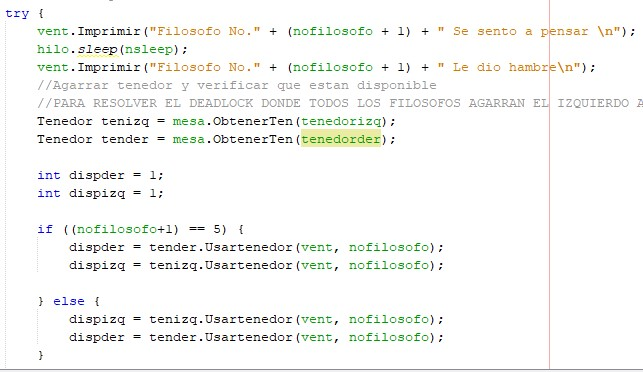
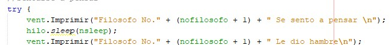

# MANUAL TECNICO PRACTICA 2
---

## Laboratorio Sistemas Operativos 2
### Vacaciones de Diciembre 2020
---

| Carnet | Nombre |
| ------ | ------ |
|200511819     |     Pablo Gerardo Garcia Perusina |
|201602517     |     Marvin Saul Guzman Garcia|
|201602811     |     Oscar Ariel Corleto Soto|

> Guatemala, 12/12/2020

---
---
> ## INDICE

- Introduccion

- Descripcion de la Aplicacion 

- PROBLEMA 1
    - Descripcion
    - Partes del programa en donde existieron múltiples procesos trabajando de forma concurrente y/o paralela, codigo y descripcion.
    - Cómo se realizó la comunicación y sincronización entre procesos.
    - Situaciones en las cuáles era posible que se dieran: deadlocks, condiciones de carrera, etc y cómo se solucionaron.
    - Variables o datos que era necesario compartir entre procesos.
    - Diagrama con imágenes del desarrollo del problema

- PROBLEMA 2
    - Descripcion
    - Partes del programa en donde existieron múltiples procesos trabajando de forma concurrente y/o paralela, codigo y descripcion.
    - Cómo se realizó la comunicación y sincronización entre procesos.
    - Situaciones en las cuáles era posible que se dieran: deadlocks, condiciones de carrera, etc y cómo se solucionaron.
    - Variables o datos que era necesario compartir entre procesos.
    - Diagrama con imágenes del desarrollo del problema

- PROBLEMA 3
    - Descripcion
    - Partes del programa en donde existieron múltiples procesos trabajando de forma concurrente y/o paralela, codigo y descripcion.
    - Cómo se realizó la comunicación y sincronización entre procesos.
    - Situaciones en las cuáles era posible que se dieran: deadlocks, condiciones de carrera, etc y cómo se solucionaron.
    - Variables o datos que era necesario compartir entre procesos.
    - Diagrama con imágenes del desarrollo del problema

---
---
> ## Introduccion

 El siguiente Manual Técnico se realizó para que el lector con conocimientos básicos de sistemas operativos y módulos de kernel, se le proporcione la lógica con la que se ha desarrollado la aplicación, También a detallar mínimas especificaciones de las funciones de cada uno de los elementos de la aplicación

---
---

> ## Descripcion de la Aplicacion

Se realizó una aplicación en la que se debio desarrollar las siguientes aplicaciones y resolver los siguientes problemas utilizando el lenguaje de
programación Java y sobre todo, aplicando de forma correcta los conocimientos vistos en el laboratorio sobre programación concurrente y desarrollo de software con múltiples
hilos. Se analizo cada uno de los problemas y desarrollar los algoritmos necesarios
para su solución.

---
---

># Problema 1 : Filosofos Pensantes

- ## Descripcion
    > Había una vez 5 filósofos que vivían juntos, la vida de cada filósofo consiste básicamente en
pensar y comer, la única comida que contribuida a sus esfuerzos pensantes era el espagueti,
por lo que todas las noches se sentaban los 5 a cenar. En la cena, sentados los 5 filósofos en
una mesa redonda que tiene una fuente de espagueti, van a existir 5 platos uno para cada
filósofo, van a existir 5 tenedores, uno al lado de cada plato (izquierda y derecha). Entonces
cada que un filósofo quiera ir a comer irá al lugar asignado en la mesa, y usando los dos
tenedores que se encuentran al lado de cada plato, los usará para comer el espagueti. Dos
filósofos no pueden utilizar el mismo tenedor a la vez

- ## Partes del programa en donde existieron múltiples procesos trabajando de forma concurrente y/o paralela, codigo y descripcion.

    - > Proceso Concurrente: cuando 2 filosofos tienen hambre al mismo tiempo y tratan de agarrar un tenedor se realiza simultaneamente.

    

    - > Proceso Concurrente: cuando un filosofo no encuentra 1 tenedor pero ya tiene 1 en su poder este tiene que soltarlo ya que no puede proceder a comer.
    
    
    
    - > Proceso Concurrente o Paralelo: cuando un filosofo termina de comer tiene que soltar los tenedores , esto  puede ser un proceso concurrente a la hora de que si 2 filosofos al mismo tiempo terminan de comer o paralelo cuando solo uno termina de comer.
    
    

    -> Proceso Concurrente: Cuando el filosofo esta pensando esto se realiza concurrentemente ya que no todos pueden comer al mismo tiempo entonces estan siempre pensando hasta la hora de que tiene hambre y trata de agarrar un tenedor

    

- ## Cómo se realizó la comunicación y sincronización entre procesos.
    - > Para empezar a iniciar los procesos se utilzaron hilos estos mismos se iniciaban cada vez que una instancia de un filosofo fue ejecutada esto lo que hace es entrar a un while donde se van ejecuntando cada proceso.

    
    
    - > La sincronizacion en este problema la utiliamos a la hora de agarrar y soltar los tenedores ya que puede que varios de los filosofos esten ejecutando este proceso al mismo tiempo entonces necesitamos sincronizar y comunicar los hilos entre si para que no ocacione bloqueos
    
    

- ## Situaciones en las cuáles era posible que se dieran: deadlocks, condiciones de carrera, etc y cómo se solucionaron.
    - > Situacion 1: A la hora de desarrollar el programa nos dimos cuenta que se puede dar un `DEADLOCK` este es ocacionado ya que puede ocurrir que Todos los filosofos al mismo tiempo agarren su tenedor derecho entonces ocurre un bloqueo que ninguno puede encontrar su tenedor derecho, la solucion a este problema es que el ultimo filosofo en querer comer tome siempre su tenedor izquierdo para asi no ocacionar este bloqueo
    
    
    
    - > Situacion 2: se dio un problema en el cual un filosofo agarra un tenedor pero no encuentra el otro disponible este no soltaba el otro tenedor ocacionando asi que se bloqueara el sistema de los demas procesos , por lo que la solucion a este problema es de que dependiendo de cual tenedor agarro lo suelte para que este disponible para otro filosofo en otra ocacion.
    
    

    - > Situacion 3: se daba un problema "visual" a la hora de que 2 procesos al mismo tiempo querian imprimir su condicion en el log esto solo ocacionaba que las palabras se intercalaran entre si , para resolver esto se utilizo un `lock` que permitia que solo un proceso a la vez utilizara este metodo.

    

- ## Variables o datos que era necesario compartir entre procesos.
    - > Las variables que se necesitaban compartir entre los mismos procesos son
        - vent , esta variable es de tipo Ventana, esta permite tener el control de toda la interfaz grafica en los diferentes procesos.
        - mesa , esta variable contenia lo que era el arreglo de tenedores, asi tambien permitia obtener el numero de la posicion del tenedor de un filosofo especifico.
        - Tenedor izquierdo y derecho , estas variables que tiene cada filosofo es una instancia a su tenedor respectivo.
        - nofilosofo, es el numero de filosofo al que se esta manejando cada proceso
    
    

    

    

    
 
- ## Diagrama con imágenes del desarrollo del problema

    >Esquema del sistema

    

    >Aplicacion
    
    

     
---
---

# Problema 2: Centro de Acopio

- ## Descripcion
    > descripcion

- ## Partes del programa en donde existieron múltiples procesos trabajando de forma concurrente y/o paralela, codigo y descripcion.

    - > parte

    

    - > parte
    
    
    
    - > parte
    
    

- ## Cómo se realizó la comunicación y sincronización entre procesos.
    - > explicacion

    
    
    - > explicacion
    
    

- ## Situaciones en las cuáles era posible que se dieran: deadlocks, condiciones de carrera, etc y cómo se solucionaron.
    - > explicacion
    
    
    
    - > explicacion
    
    

- ## Variables o datos que era necesario compartir entre procesos.
    - > explicacion
    
    
    
    - > explicacion
    
    
- ## Diagrama con imágenes del desarrollo del problema

    

---
---

# Problema 3 : Barberos Dormilones

- ## Descripcion
    > descripcion

- ## Partes del programa en donde existieron múltiples procesos trabajando de forma concurrente y/o paralela, codigo y descripcion.

    - > parte

    

    - > parte
    
    
    
    - > parte
    
    

- ## Cómo se realizó la comunicación y sincronización entre procesos.
    - > explicacion

    
    
    - > explicacion
    
    

- ## Situaciones en las cuáles era posible que se dieran: deadlocks, condiciones de carrera, etc y cómo se solucionaron.
    - > explicacion
    
    
    
    - > explicacion
    
    

- ## Variables o datos que era necesario compartir entre procesos.
    - > explicacion
    
    
    
    - > explicacion
    
    
- ## Diagrama con imágenes del desarrollo del problema

    

---
---

